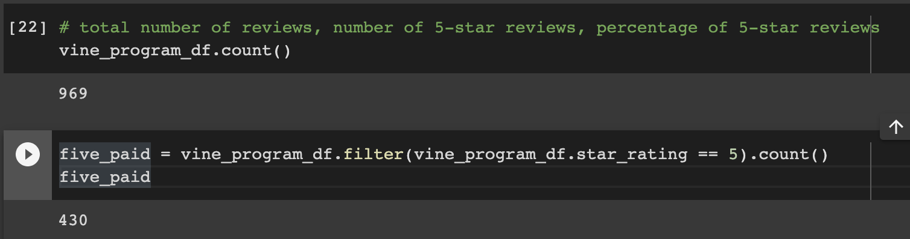
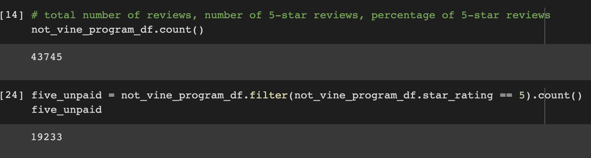

# Amazon_Vine_Analysis
## Overview
This is an analysis of product reviews solicited by SellBy and the Amazon Vine program. The Vine program is a paid service that incentivizes product reviews by providing products to Vine members free of charge and requiring them to publish a review. This analysis utilizes PySpark and pgAdmin to review data about office supply reviews.

## Results
First, the data was pared down only to reviews which recieved at least 20 votes, and then reviews where the number of helpful votes divided by the total votes is equal to or greater than 50%. From there the reviews were split by Vine reviews and non-Vine reviews.

* There were 969 vine reviews, and 43,745 non-Vine reviews.

* Of the 969 Vine reviews, 430 of them gave 5-star ratings. Of the 43,745 non-Vine reviews, 19,233 of them gave 5-star ratings.

* 44% of vine reviews gave 5-star ratings, and 44% of non-vine reviews gave 5-star ratings.

## Summary
Based on the identical percentage of 5-star ratings in both the Vine and non-Vine review datasets, there does not appear to be any positivity bias for reviews in the Vine program. Some additional analysis that could shed more light on this might filter for verified purchases only, or calculate the percentage of 1-star ratings in the Vine and non-Vine datasets.